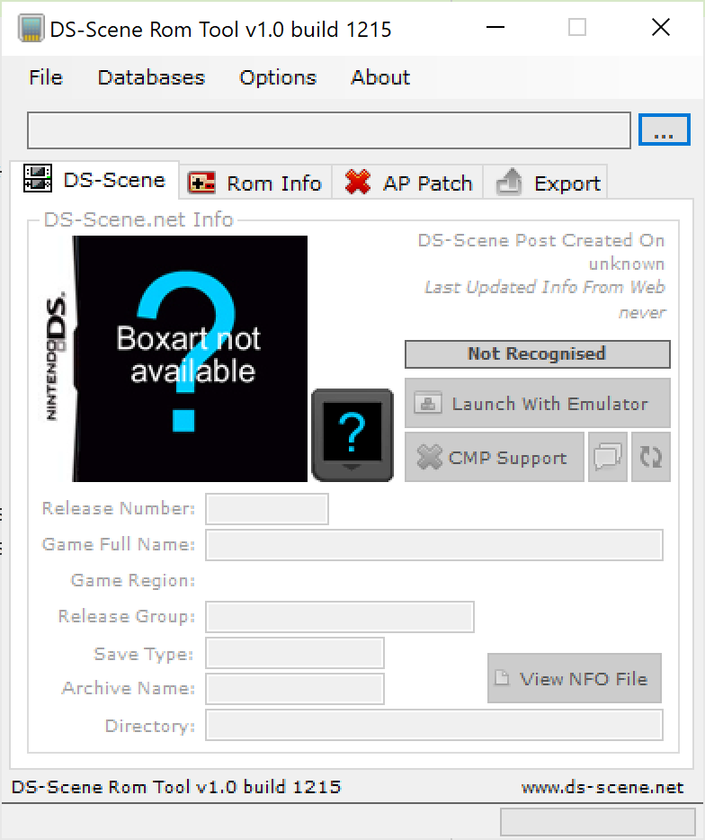

# DS-Scene ROM Tool

This program seems to be an all-in-one for Nintendo DS games. It provides
general information of the game, including the box art, and its features like if
it has multiplayer gameplay. It allows to apply anti-piracy patches to the games
and list the known cheat list. And this is the interesting part.

It is unknown who (person or team) is actually responsable for the anti-piracy
patches, but we can get more information by understanding how this program works
since it can self-update the anti-piracy database.



- **Author**: (retrogamefan?) maintained by www.ds-scene.net and retrogamefan
- **Last known version**: 1.0 build 1215
- **Download URL**:
  [gbatemp](https://gbatemp.net/download/retrogamefan-nds-rom-tool-v1-0_b1215.35735/)

## Target features

Between all the feature the program has, the one we are interested are:

- [x] Game anti-piracy patching
  - [x] How to detect games
  - [x] Database updates
  - [x] Format of the database
  - [x] Game patching process
- [x] Cheat database
  - [x] Updates of the database
  - [x] Format of the database list
- [x] Game features
  - [x] How to get the game features
  - [x] How to get and read the NFO
  - [x] How to get the box art
  - [x] How to get the CRC (and alternatives CRC)
- [x] Program updates
  - [x] Place to download
  - [x] Changelog

## Encryption

The program encrypts and decrypts several files. For all of them it uses the
same algorithm: DES by initializing the _key_ and _IV_ to the same hard-coded
value that depends in the type of file.

The key is hard-coded inside the program as an string. It takes the first 16
chars and convert to bytes in hexadecimal format. Usually the string has the
double size but it is always truncate to have 8 bytes. It seems to be a bug
after encoding characters in UTF-16.

It also has a method to generate keys by converting to ASCII the output from
`DES.Create().Key`, although it is not used at this moment.

## Anti-piracy database

In the tab _AP Patch_ we can see what the program can do. It shows the patch
information, the author and the game name.

The AP database is at `data/databases/offsets.dsapdb`. It is encrypted with the
key `790077003F0028003F0050003F003F00`. It is a text file that look like this:

```plain
3049 - Layton Kyouju to Saigo no Jikan Ryokou [954C7551] Rudolph
000047E0: 81 E1 12 9A 41 E3 0F 44 40 36 EC 82 1A 49 14 94 → 10 00 9F E5 10 C0 9F E5 00 C0 80 E5 44 C0 80 E5
000047F0: 05 2C C4 B2 F0 AA 20 C5 79 D4 15 0F EE 52 00 00 → 05 00 A0 E1 5B 01 00 EA AC 8F 0F 02 EC 30 0F 02
00004D64: 05 00 A0 E1 → 9D FE FF EA
```

The format is:

```plain
game_name [hash] author
offset_hex1 original_bytes → patched_bytes
...
offset_hexN original_bytes → patched_bytes
\n
```

The author field is optional. The program supports a maximum of 5000 entries.

The program can export the patch for a specific game in plan text format or
encrypted with the key `790077003F0028003F0050003F003F00` for the extension
`dsapf`.

To get the latest version of the database the program does:

1. Download `http://files-ds-scene.net/romtool/releases/databases/version.bin`
   into `data/temp/`
2. Decrypt the file with the key `790077003F0028003F0050003F003F00`
3. Read a maximum of 20 lines with format `name|version`
4. Read the file `data/databases/version.bin` encrypted with the key
   `790077003F0028003F0050003F003F00`
5. For each of the files with different version between the two files
   1. Download
      `http://files-ds-scene.net/romtool/releases/databases/changelog_db.bin`
      into `data/temp/`
   2. Decrypt it with the key `790077003F0028003F0050003F003F00`
   3. Show the changelog with format RTF
6. Download
   `http://files-ds-scene.net/romtool/download.php?f=releases/databases/{name}`
   into `data/databases/`
7. Move `version.bin` from the temp folder to `data/databases/`

To patch a game it just go to the offset and replace the original bytes byt the
new ones.

## Cheat database

To get the latest version of the database the program does:

1. Download `http://files-ds-scene.net/romtool/releases/cmp/version_cmp.bin`
   into `data/temp/`
2. Decrypt the file with the key `3F006F003F003F001000000069003F00`
3. Read a maximum of 20 lines with format `name|version`
4. Read the file `data/databases/version_cmp.bin` encrypted with the key
   `3F006F003F003F001000000069003F00`
5. For each of the files with different version between the two files
   1. Download
      `http://files-ds-scene.net/romtool/releases/cmp/changelog_cmp.bin` into
      `data/temp/`
   2. Decrypt it with the key `3F006F003F003F001000000069003F00`
   3. Show the changelog with format RTF
6. Download
   `http://files-ds-scene.net/romtool/download.php?f=releases/cmp/{name}` into
   `data/databases/`
7. Download `http://files-ds-scene.net/romtool/releases/cmp/cmpGameList.bin`
   into `data/databases/`
8. Write the files and their version in `data/temp/version_cmp.txt`
9. Encrypt it with key `3F006F003F003F001000000069003F00`
10. Move it to `data/databases/version_cmp.bin`
11. Decrypt `cmpGameList.bin` with the key `3F006F003F003F001000000069003F00`

The format of `cmpGameList.bin` is:

```plain
EU Games: 001
JP Games: 001
US Games: 001
Other Games: 01
------------------------------------------------------------------------
<game_name> (<region>) {<game_code> <game_hash>}
...
```

To install the cheat file it simply uncompress the files into the desired
destination.

## Game features

To get the game information it does:

1. Download `http://www.ds-scene.net/romtool.php?version=2&hash={hash}`
2. Encrypt it with the key `790077003F0028003F0050003F003F00` into the file
   `data/web/info/{hash}_info.dsapdb`
3. Read a maximum of 20 lines with the format `key>=value`
4. Download the boxart from its value into `data/web/images/{hash}.jpg`
5. Download the icon from its value into `data/web/images/{hash}.png`
6. Download the NFO from its value into `data/web/nfo/{hash}.nfo`
7. Download the region image from
   `http://www.ds-scene.net/data/images/icons/flags/{romrgn}.gif` into
   `data/web/images/`

The NFO files are text files encoded with double line-ending.

It keeps a cache of information from the ROM header by creating a key-value text
file under `data/header_cache/{hash0}/{hash}.dsrhd`, where `hash0` is the first
char of the `hash`. It encrypts these files with the key
`790077003F0028003F0050003F003F00`.

There is also a database of potential CRC for a given file. The file is
`data/databases/crc_dupes.dscrcdb` and it is encrypted with the key
`790077003F0028003F0050003F003F00`. It is a text file with a line per game as
follow: `clean_crc|crc_alt1,type|crc_alt2,type|...`. The type can be:

- 0: Clean
- 1: AP patched
- 2: Trimmed
- 3: AP patched and trimmed
- 4: Unknown

The game computes the CRC by doing a CRC32 over the whole file.

## Program updates

In the folder there is a program named `updater_v0.2.exe`. It is really small
and what it does is:

1. Search for running processes with name `DS-Scene Rom Tool`
2. Close the main window of all these processes
3. If the folder `data/temp/update/` doesn't exist, it fails
4. Move all the content of `data/temp/update/` recursively into the program
   directory
   1. It skip files with name `updater.exe` (it seems to be a bug since this
      program it's named `updater_v0.2.exe`).
5. Start the program `DS-Scene Rom Tool.exe`

Interesting enough, when there is an error and they want the user knows about
it, what it does is to print to the standard output and then do an infinite
loop. I guess expecting the user to kill the process after reading the message.

Let's check the other part. On the start-up of the application it checks if some
files are missing and it will download them.

- `updater_v0.2.exe`:
  http://files-ds-scene.net/romtool/releases/updaters/updater_v0.2.exe
- `7z.dll`: http://files-ds-scene.net/romtool/releases/7z.dll
- `unrar.dll`: http://files-ds-scene.net/romtool/releases/unrar.dll

Then it checks for program updates as follow:

1. Download
   `http://files-ds-scene.net/romtool/releases/latest_version_build_1200.bin`
   into `data/temp/`
2. Decrypt with the key `790077003F0028003F0050003F003F00` and read a line
3. If the line is the current hard-coded version `1.0 build 1215`, stop
4. Open a modal dialog to confirm the update
   1. Download the file
      `http://files-ds-scene.net/romtool/releases/changelog_build_1200.bin` into
      `data/temp/`
   2. Decrypt with the key `790077003F0028003F0050003F003F00`
   3. Read line by line. The format is RTF.
5. Download
   `http://files-ds-scene.net/romtool/download.php?f=releases/DS-Scene Rom Toolv{version}.rar`
   into `data/temp/`
6. Extract the RAR file
7. Replace `latest_version_build_1200.bin` with the one from `data/temp/`
8. Run `updater_v0.2.exe`

## Program options

The settings are saved into: `data/options.bin` encrypted with the key
`790077003F0028003F0050003F003F00`. It supports a maximum of 20 lines of
key-values.

- `active_collection_db`
- `auto_info_dl`
- `emu_X`
- `emu_default`
- `endrypts`
- `disable_crc_db`
- `disable_update`
- `ap_update_check`
- `cmp_usrcheat_update_check`
- `cmp_edgecheat_update_check`
- `cmp_cyclocheat_update_check`
- `auto_open_collections`
- `disable_web`
- `disable_webalert`
